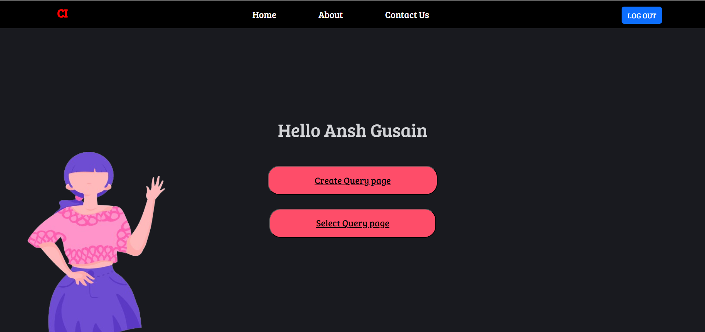
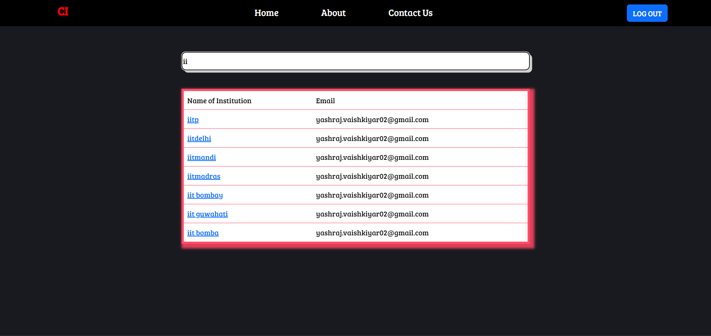

# Clear Insight

Clear Insight is a public portal website developed to address hostel and organizational challenges by enabling streamlined issue submission, support, and filtering for improved transparency.

## Project Overview

This project was developed during a Hackathon in April 2024 using the following technologies:
- Node.js
- Express.js
- MongoDB
- React.js

## Features

- **Issue Submission**: Users can submit issues using a user-friendly form.
  

- **Issue List and Filtering**: View and filter submitted issues to maintain transparency.
  

- **User Authentication**: Secure user authentication with Auth0.
  

- **Admin Dashboard**: Manage Query Pages.
  
  

## Backend Development

I led the backend development for the team, utilizing Node.js and Express.js to design and implement scalable APIs and backend services. The backend integrates with MongoDB to ensure efficient data management and optimize server-side operations for seamless performance.
